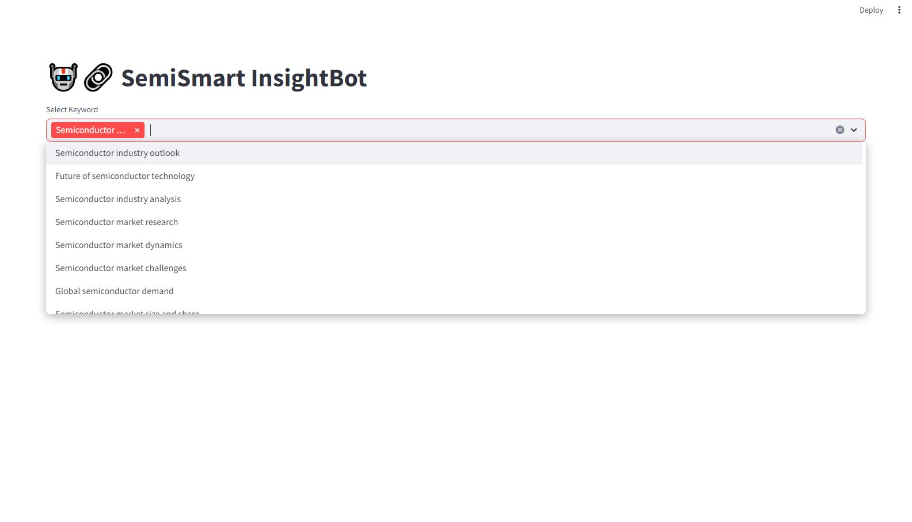
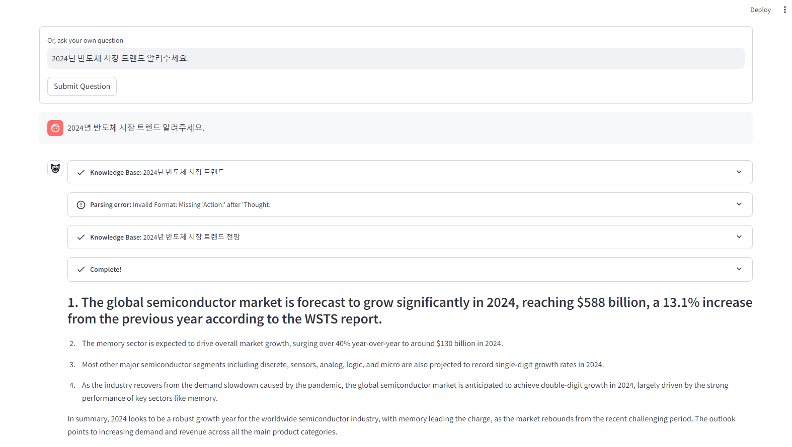
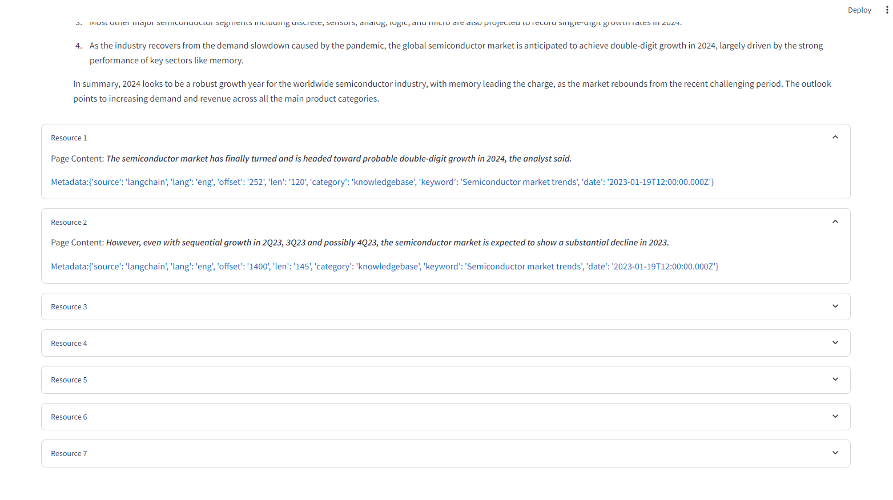
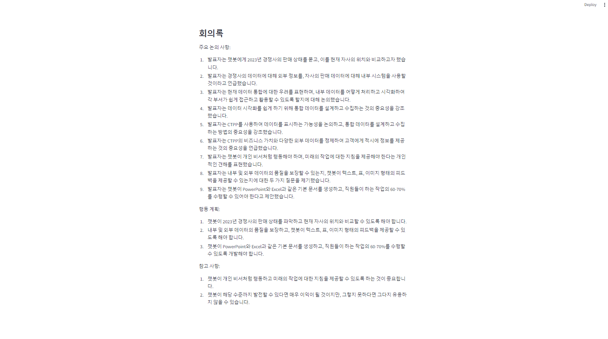
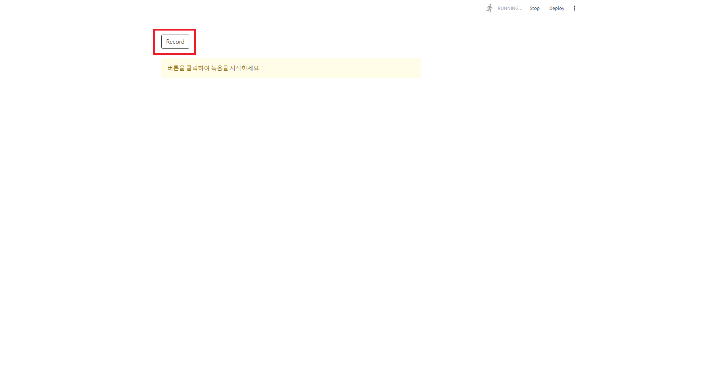
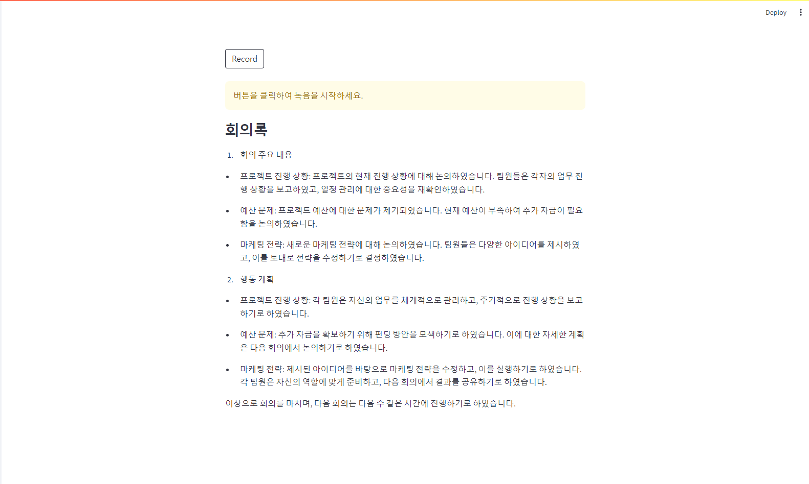

# 😎 Welcome to Streamlit Chatbot

### Langchain 및 Streamlit을 활용한 챗봇

패키지 설치: pip install -r requirements.txt

streamlit 실행: streamlit run Hello.py

# 🤖 Semibot Insight
### 💡 주요내용
###  특정 분야에 특화된 RAG를 구성하여 전문적인 답변을 할 수 있습니다.

#### 해당 챗봇에는 반도체 기반 정보가 담겨있습니다.

**`키워드`를 선택한 후 질문을 하면**

**아래와 같이 답변하는 것을 확인할 수 있습니다.**

**답변에 대한 `Meta`도 확인할 수 있습니다.**

# 🦜 Chat with SQL DB
### 💡 주요내용

### SQLDB를 기반으로 데이터에 대해 질문하고 쿼리할 수 있는 챗봇

**`테이블` 및 `데이터`에 대한 정보에 대해 질문할 수 있습니다.**

# 🎥📚 MeetingMinutes_Video
### 💡 주요내용

### 비디오 파일의 오디오를 추출하여 회의록을 작성하는 챗봇 시스템

**화상회의 녹화본과 같이 비디오 파일에서 오디오를 추출하여 회의록을 작성한 것을 확인 할 수 있습니다.**

# 🎙️📚 MeetingMinutes_Recoder
### 💡 주요내용

### 녹음을 통해 회의록을 작성하는 챗봇 시스템

**`Record`를 버튼을 클릭하면 녹음을 실행하고 한 번 더 클릭하면 녹음이 종료됩니다.**

**녹음된 내용으로 회의록을 작성한 것을 확인 할 수 있습니다.**

# 🕒 MeetingMate
### 💡 주요내용

### 회의실 정보를 기반으로 회의실을 예약할 수 있는 챗봇 시스템
